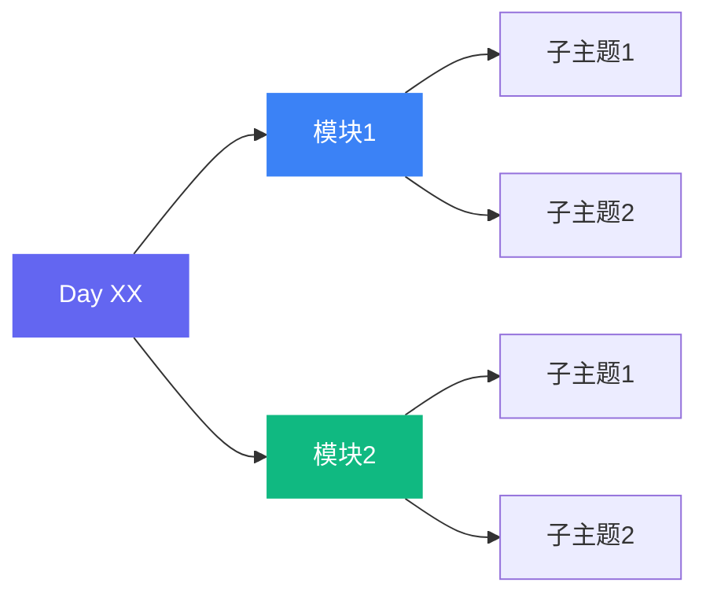

# Daily Study Digest v2.0(每日学习笔记整理器 + 知识沉淀)

将一天的学习代码(`.py`)和笔记(`.md`)自动整理为结构化 Markdown 文档,按 **⭐ 核心概念 / 🔧 常用 API / 💡 进阶实战** 三层结构输出,带双层 Mermaid 知识图谱、代码四问分析、API 速查表,并同步沉淀到 `knowledge/` 长期知识库。

---

## 一、触发方式

支持 3 种触发:

| 方式 | 示例 | 处理 |
|---|---|---|
| **上传 zip** | 拖入 `day_05.zip` | 解压到临时目录后扫描 |
| **指定路径** | "总结 01-python/day_05" / "总结 day_05" | 直接扫描该目录 |
| **对话触发** | "整理今天的学习内容" / "总结 day_05" | 在已知目录下找 day_XX |

**路径解析规则**:用户给出 `day_05` 或 `01-python/day_05` 时,尝试以下根目录查找(运行时由 `git rev-parse --show-toplevel` 或环境变量 `REPO_ROOT` 推断,**不硬编码本机绝对路径**):

1. `<repo-root>/01-python/day_05`
2. `<repo-root>/02_mysql/day_05`
3. `<repo-root>/03-linux/day_05`
4. `<repo-root>/04-numpy_and_pandas/day_05`

找到第一个存在的目录即开始处理。

---

## 二、四种目录结构识别

### 模式 1:NumPy/Pandas 模式
**识别特征**:存在 `02_code/` 或 `codeAll/` 子目录
```
day_XX/
  02_code/ 或 codeAll/
    numpy/        → 模块 "NumPy 核心"
    pandas/       → 模块 "Pandas 基础"
    pandasv2/     → 模块 "Pandas 进阶"
    pandasv3/     → 模块 "Pandas 高阶"
    Matplotlib可视化/
    Pandas可视化/
    综合案例*/
```
**文件归类**:`NN_xxx.py` 按编号排;`学生提问xxx.py` → 课堂问答块

### 模式 2:Python 基础模式
**识别特征**:存在 `day0N_code/` 或 `第N章*.md`
```
day_XX/
  day0X_code/
    p0N_主题.py
  第N章_主题.md
  day0X_晨考题.md
```
**文件归类**:`p0N_xxx.py` 按编号排;`第N章.md` → 理论;`晨考题.md` → 晨考块

### 模式 3:Linux/FastAPI 模式
**识别特征**:存在 `day0N-代码/` 和 `day0N-笔记/`
```
day_XX/
  day0N-代码/
    demo1/ ~ demo7/
      fa_N.py
  day0N-笔记/
    FastAPI.md
  day0N-晨考.pdf
```
**文件归类**:`demoN/` 作为模块;`*.md` → 理论;PDF 用 pdftotext 提取后 → 晨考块

### 模式 4:MySQL 模式
**识别特征**:存在 `01_笔记/` 或尚硅谷笔记
```
day_XX/
  01_笔记/03_尚硅谷xxx/
    xxx.md
  04_练习-2/
  上课脚本/
```
**文件归类**:`01_笔记/*.md` → 理论;`04_练习/` → 实操;`上课脚本/*.sql` → 实操

### 模式 5:通用模式(fallback)
**识别特征**:不匹配以上任何模式
**处理**:扫描所有 `.py` 和 `.md` 文件,按文件名排序,逐个解析

---

## 三、三层结构分类规则

### 3.1 ⭐ 核心概念(必须掌握)

从 `.py` 文件的 docstring 提取:
- 框架核心 API:`np.array()` / `pd.Series()` / `pd.DataFrame()`
- 索引体系:`loc` / `iloc` / `at` / `iat`
- 关键机制:广播、矢量化、分组聚合

从 `.md` 文件提取:`##` 标题下的核心定义、对比表、易错点

### 3.2 🔧 常用 API(常规使用)

按功能分组列出,带表格:
- NumPy:创建函数表 / 统计函数 / 切片索引
- Pandas:Series 常用方法 / DataFrame 常用方法
- 导入导出 / 日期处理 / 数据组合 / 缺失值处理 / 透视表

### 3.3 💡 进阶实战(易错+关联+代码四问)

- **易错点速记表**:对照列出(如 `array()` vs `asarray()`、`*` vs `@`、`loc` vs `iloc`)
- **知识关联**:NumPy→Pandas 底层、groupby→SQL、Pandas plot→Matplotlib
- **学生提问**融入对应知识点(如众数→mode、随机种子→sample、自由度→var)
- **综合实战**:员工数据分析、房产分析等综合案例

### 3.4 代码四问分析

对每段**重要代码**(非简单示例),回答四个问题:

```python
# 代码示例
```

| 问题 | 说明 |
|---|---|
| 🎯 做什么 | 这段代码的功能是什么 |
| 🔧 为什么有效 | 核心原理 / API 行为是什么 |
| ⚠️ 常见错误 | 初学者容易踩的坑 |
| 🚀 改进方案 | 更优写法 / 生产环境注意事项 |

**示例**:
```python
arr1 = np.array([1, 2, 3])        # (3,)
arr2 = np.array([[4], [5], [6]])  # (3,1)
print(arr1 + arr2)  # 自动广播成 (3,3)
```
| 问题 | 说明 |
|---|---|
| 🎯 做什么 | 一维数组与列向量相加,得到 3×3 矩阵 |
| 🔧 为什么有效 | 广播机制:`(3,)` 横向复制行,`(3,1)` 纵向复制列,都变成 `(3,3)` |
| ⚠️ 常见错误 | `(3,)` 和 `(2,)` 不兼容:3≠2 且无 1,报错 |
| 🚀 改进方案 | 大数据量时用 `np.add(arr1, arr2, out=preallocated)` 避免临时数组 |

### 3.5 ☀️ 晨考部分(单独成块)

- 文件名含"晨考"的 `.md` → 整文件提取
- 文件名含"晨考"的 `.pdf` → `pdftotext` 提取
- 文件名含"学生提问"的 `.py` → 作为"课堂问答"融入对应知识点

### 3.6 📝 小总结 + 📋 API 速查表

**小总结**(3-5 条要点):
- ⭐ 核心 API 速记
- 💡 易错点提醒
- 🔗 模块关联

**API 速查表**(NumPy vs Pandas 对照):
| 功能 | NumPy | Pandas |
|---|---|---|
| 创建 | `np.array([1,2,3])` | `pd.Series([...])` / `pd.DataFrame({...})` |
| 索引 | `a[0:2, 1:3]` | `df.loc["a":"d"]` / `df.iloc[0:3]` |
| ... | ... | ... |

---

## 四、双层知识图谱

### 4.1 学习路径层(跨天累积)

在 `knowledge/` 目录维护一条全局学习路径,显示当前在第几站:


### 4.2 每日细节层(当天内容)

在每日 MD 开头放当天知识图谱:



### 4.3 Mermaid 兼容性

使用 `graph LR` 而非 `flowchart`(兼容性更好);避免 `<br/>` 换行;避免 `&amp;` 实体。

---

## 五、知识沉淀(knowledge/ 累积目录)

### 5.1 目录结构

每次生成每日 MD 后,同步更新 `knowledge/` 目录(位于 `<repo-root>/knowledge/`):

```
knowledge/
├── concepts.md      # 概念库(跨天累积)
├── api-index.md     # API 索引(跨天累积)
├── mistakes.md      # 错题/易错库(跨天累积)
├── questions.md     # 问题库(学生提问 + 面试问题)
└── review.md        # 复习清单(近期需回顾的知识点)
```

### 5.2 concepts.md 格式

```markdown
# 概念库

## NumPy
### ndarray 创建
- **首次学习**: Day 04 (2026-06-24)
- **核心要点**: `np.array()` 接收列表创建数组;`asarray()` 不 copy 共享内存
- **关联**: → Pandas Series 底层就是 ndarray

### 广播机制
- **首次学习**: Day 04 (2026-06-24)
- **核心要点**: 两维度相等或其中一个是 1 即可广播
- **关联**: → 矩阵乘法(不同概念)

## Pandas
### loc / iloc
- **首次学习**: Day 04 (2026-06-24)
- **核心要点**: loc 左闭右闭按标签;iloc 左闭右开按位置
- **关联**: → DataFrame 索引体系
```

### 5.3 api-index.md 格式

```markdown
# API 索引

## NumPy
| API | 用途 | 示例 | 首次出现 |
|---|---|---|---|
| `np.array(list)` | 创建数组 | `np.array([1,2,3])` | Day 04 |
| `np.zeros(shape)` | 全0数组 | `np.zeros((2,3))` | Day 04 |
| `np.dot(a, b)` | 矩阵乘法 | `a @ b` | Day 04 |

## Pandas
| API | 用途 | 示例 | 首次出现 |
|---|---|---|---|
| `pd.Series(data)` | 创建 Series | `pd.Series([1,2,3])` | Day 04 |
| `df.loc[label]` | 标签索引 | `df.loc["a":"d"]` | Day 04 |
| `df.groupby(col)` | 分组聚合 | `df.groupby("dept")["sal"].mean()` | Day 04 |
```

### 5.4 mistakes.md 格式

```markdown
# 错题 / 易错库

## Day 04
### `array()` vs `asarray()` 混淆
- **错误**: 以为 `asarray()` 也 copy
- **纠正**: `asarray()` 输入是 ndarray 时不 copy,共享内存
- **口诀**: array 总 copy,asarray 看输入

### `*` vs `@` 混淆
- **错误**: 用 `*` 做矩阵乘法
- **纠正**: `*` 是对位乘法,`@` 才是矩阵乘法
- **口诀**: 星对位,圈矩阵
```

### 5.5 questions.md 格式

```markdown
# 问题库

## 学生提问
### 为什么方差默认除以 N-1?
- **来源**: Day 04 学生提问
- **答案**: 贝塞尔修正,样本比总体更集中,除以 N-1 抵消抽样低估
- **关联**: `var(ddof=1)` 样本方差 / `var(ddof=0)` 总体方差

## 面试问题
### [从面试问题集同步] loc 和 iloc 的区别?
- **来源**: 面试问题集 Python Q13
- **答案**: loc 左闭右闭按标签,iloc 左闭右开按位置
```

### 5.6 review.md 格式

```markdown
# 复习清单

> 近期需要回顾的知识点,按优先级排序

## 高优先级(易错+核心)
- [ ] 广播机制规则(Day 04):两维度相等或为1
- [ ] loc vs iloc(Day 04):左闭右闭 vs 左闭右开
- [ ] `*` vs `@`(Day 04):对位乘 vs 矩阵乘

## 中优先级(常用 API)
- [ ] groupby 三步走(Day 04):分组→选列→聚合
- [ ] 缺失值处理(Day 04):dropna / fillna / interpolate

## 低优先级(了解)
- [ ] 银行家舍入(Day 04):四舍六入五成双
```

### 5.7 更新规则

- **新增**: 当天学的新概念/API/错题,追加到对应文件末尾
- **去重**: 如果概念已存在,更新"首次学习"为"最近复习"日期,不重复添加
- **关联**: 新概念尽量关联到已有概念,形成知识网络
- **可选联动**: 调用 [interview-question-tracker](./interview-question-tracker) 把技术问题同步到 `notes/面试问题集.md`

---

## 六、输出规范

### 6.1 文件命名与存放

| 文件 | 路径 | 说明 |
|---|---|---|
| 每日 MD | `<repo-root>/<科目>/day_XX/day_XX_digest.md` | 当天笔记 |
| 概念库 | `<repo-root>/knowledge/concepts.md` | 跨天累积 |
| API 索引 | `<repo-root>/knowledge/api-index.md` | 跨天累积 |
| 错题库 | `<repo-root>/knowledge/mistakes.md` | 跨天累积 |
| 问题库 | `<repo-root>/knowledge/questions.md` | 跨天累积 |
| 复习清单 | `<repo-root>/knowledge/review.md` | 近期回顾 |

文件编码:UTF-8

### 6.2 每日 MD 模板

```markdown
# Day XX 学习笔记 — [主题]

> 📅 YYYY-MM-DD | N 个文件 | [模块名] | 学习路径: Python → ... → 当前站

## 🗺️ 知识图谱

> ← graph LR 树形 · 从左到右层级展开 · 紧凑不发散


## ⭐ 核心概念(必须掌握)

### [子主题]
- 要点 1
- 要点 2

## 🔧 常用 API

### [API 分类]
```python
# 关键示例 3-5 行
```

## 💡 进阶实战

### 代码四问
```python
# 重要代码
```
| 问题 | 说明 |
|---|---|
| 🎯 做什么 | ... |
| 🔧 为什么有效 | ... |
| ⚠️ 常见错误 | ... |
| 🚀 改进方案 | ... |

### 易错点速记
| 易错点 | 区别 |
|---|---|
| ... | ... |

> 💡 **学生提问**:[问题]
> 答:[答案]

### 综合实战
```python
# 解题代码
```

## ☀️ 晨考题

### 题目类型 1
1. 题目内容
2. ...

## 📝 小总结

- 要点 1
- 要点 2
- 要点 3
- 要点 4
- 要点 5

## 📋 API 速查表

| 功能 | NumPy | Pandas |
|---|---|---|
| ... | ... | ... |

## 🔗 知识沉淀

> 本次学习已同步到 knowledge/ 目录:
> - concepts.md 新增 N 个概念
> - api-index.md 新增 N 个 API
> - mistakes.md 新增 N 个易错点
> - questions.md 新增 N 个问题
> - review.md 更新复习清单
```

### 6.3 Markdown 格式要求

| 元素 | 格式 |
|---|---|
| 标题层级 | `#` 大标题 / `##` 三层结构 / `###` 子主题 |
| 思维导图 | 开头 `mermaid graph LR`,4-5 节点,带 style 配色 |
| 代码块 | 三反引号包裹,标注 `python` |
| 代码四问 | 重要代码附四问表格(做什么/为什么/常见错误/改进) |
| 重点标注 | ⭐ 必须 / 💡 易错 / 🔗 关联 / 🎯 做什么 / ⚠️ 错误 |
| 列表 | `-` 无序,`1.` 有序 |
| 强调 | `**粗体**` 关键 / `代码` 行内 |
| 表格 | 标准 markdown |
| 引用 | `>` 引用块用于说明、提问 |
| 折叠 | 完整长代码用 `<details><summary>...</summary>...</details>` 折叠 |
| 分隔线 | `---` 分隔大段 |
| 图片 | 保留 `` 引用 |

---

## 七、执行流程

### Step 1: 获取学习目录

1. 如果用户上传 zip → 解压到临时目录
2. 如果用户指定路径 → 解析路径,在 4 个根目录中查找
3. 如果用户只说"总结 day_XX" → 在 4 个根目录中自动查找

### Step 2: 识别目录模式

扫描目录结构,按以下优先级匹配:
1. 存在 `02_code/` 或 `codeAll/` → 模式 1(NumPy/Pandas)
2. 存在 `day0N_code/` 或 `第N章*.md` → 模式 2(Python 基础)
3. 存在 `day0N-代码/` → 模式 3(Linux/FastAPI)
4. 存在 `01_笔记/` → 模式 4(MySQL)
5. 其他 → 模式 5(通用)

### Step 3: 扫描文件

按识别的模式扫描对应文件:
- 模式 1:`02_code/*/*.py` 或 `codeAll/*/*.py`
- 模式 2:`day0N_code/*.py` + `*.md`
- 模式 3:`day0N-代码/demo*/*.py` + `day0N-笔记/*.md`
- 模式 4:`01_笔记/**/*.md` + `04_练习/*` + `上课脚本/*`
- 模式 5:所有 `.py` + `.md`

### Step 4: 并行解析(子代理)

文件数 > 10 时,启动最多 3 个 Explore 子代理并行解析不同子目录,每个返回结构化内容:
- 理论要点列表
- 关键代码示例(3-5 行)
- 学生提问 / 课堂问答

### Step 5: 分类汇总 + 代码四问

按三层结构归类:
1. ⭐ 核心概念(框架核心 API、索引体系、关键机制)
2. 🔧 常用 API(各功能模块的常用方法、表格化)
3. 💡 进阶实战(易错点、知识关联、综合案例、学生提问)
4. 对每段重要代码执行**四问分析**(做什么/为什么有效/常见错误/改进方案)

### Step 6: 生成每日 MD

1. 开头加 Mermaid `graph LR` 知识图谱(4-5 节点)
2. 套用三层结构模板 + 代码四问
3. 晨考题单独成 `## ☀️ 晨考题` 块
4. 结尾加 API 速查表
5. 结尾加"知识沉淀"统计(新增了多少概念/API/错题/问题)
6. 保存到目标路径

### Step 7: 更新 knowledge/ 知识库

1. 读取现有 `knowledge/concepts.md`,追加新概念(去重)
2. 读取现有 `knowledge/api-index.md`,追加新 API(去重)
3. 读取现有 `knowledge/mistakes.md`,追加新错题
4. 读取现有 `knowledge/questions.md`,追加学生提问 + 面试问题
5. 更新 `knowledge/review.md` 复习清单(新知识点加入高优先级)
6. 如果 `knowledge/` 目录不存在,首次创建并初始化所有文件

### Step 8: 报告结果

向用户报告:
- 解析了几个文件、几个子模块
- 每日 MD 输出路径
- knowledge/ 知识库更新统计(新增 N 个概念、N 个 API、N 个错题、N 个问题)
- 用 `computer://` 链接分享

---

## 八、质量检查清单

生成后必须验证:
- [ ] 所有文件都被覆盖(无遗漏)
- [ ] 理论部分保留原文表述
- [ ] 实操代码块精简到 3-5 行,完整代码用 `<details>` 折叠
- [ ] 重要代码有四问分析(做什么/为什么/常见错误/改进)
- [ ] 晨考题单独成块,不与理论混合
- [ ] 学生提问融入对应知识点(不放在最后)
- [ ] 小总结包含 3-5 条核心要点
- [ ] 易错点用表格列出
- [ ] API 速查表覆盖主要功能
- [ ] Mermaid 知识图谱在开头(双层:学习路径 + 每日细节)
- [ ] 代码块标注 `python` 语言
- [ ] knowledge/ 目录已更新(5 个文件)
- [ ] knowledge/ 去重正确(不重复添加已有概念)
- [ ] 文件编码为 UTF-8
- [ ] Markdown 语法正确

---

## 九、特殊情况处理

### 9.1 晨考题是 PDF 格式
```bash
pdftotext day0N-晨考.pdf - | head -100
```

### 9.2 没有显式总结
基于理论+实操自动提炼 3-5 条要点,口诀、对比表精华版优先。

### 9.3 文件名乱码
用 Python 重新解压:
```python
import zipfile
with zipfile.ZipFile('day_03.zip') as z:
    z.extractall('day_03', pwd=None)
```

### 9.4 SQL 文件
MySQL 模式下的 `.sql` 文件按代码块处理,标注 `sql` 语言。

### 9.5 长代码折叠
超过 20 行的完整代码用 `<details>` 折叠:
```markdown
<details>
<summary>📋 完整代码(点击展开)</summary>

```python
# 完整脚本
```
</details>
```

### 9.6 Mermaid 兼容性
使用 `graph LR` 而非 `flowchart`(兼容性更好);避免 `<br/>` 换行;避免 `&amp;` 实体。

### 9.7 knowledge/ 目录首次创建
如果 `<repo-root>/knowledge/` 不存在,首次创建并初始化:
```bash
mkdir -p <repo-root>/knowledge
```
然后生成 5 个初始文件(concepts.md / api-index.md / mistakes.md / questions.md / review.md),每个文件带标题和空结构。

### 9.8 代码四问适用范围
只对**重要代码**(核心 API 用法、易错示例、综合实战)执行四问分析。简单示例(如 `print(arr.ndim)`)不需要四问。

---

## 十、与现有系统的集成

### 10.1 版本对比

| 维度 | v1.0 | v2.0 |
|---|---|---|
| 输出 | 1 个每日 MD | **1 个每日 MD + knowledge/ 知识库** |
| 知识沉淀 | 无(每天独立) | **跨天累积**(概念/API/错题/问题) |
| 知识图谱 | 单层(当日) | **双层**(学习路径 + 每日细节) |
| 代码分析 | 贴代码 | **代码四问**(做什么/为什么/常见错误/改进) |
| 复习机制 | 无 | **review.md 复习清单** |

### 10.2 与 daily-learning-summary skill 的区别

| 维度 | daily-learning-summary(旧) | daily-study-digest v2.0 |
|---|---|---|
| 输出格式 | HTML | **Markdown** |
| 目录支持 | 仅 NumPy/Pandas | **4 种目录 + 通用** |
| 结构 | 三段(理论/实操/总结) | **三层(⭐/🔧/💡)+ 知识图谱 + 速查表 + 代码四问** |
| 知识沉淀 | 无 | **knowledge/ 跨天累积** |
| 晨考题 | 混在理论里 | **单独成块** |
| 触发方式 | 仅上传 zip | **上传 + 路径 + 对话** |
| 适用范围 | NumPy/Pandas 专用 | **全科目通用** |

### 10.3 与 index.html 集成(可选)
如果存在 `index.html` 总入口,生成 MD 后可选更新索引。

### 10.4 与面试问题集集成(可选)
调用 [interview-question-tracker](./interview-question-tracker) skill 同步更新 `notes/面试问题集.md`,同时把面试问题沉淀到 `knowledge/questions.md`。

---

## 十一、注意事项

1. **忠实原文**:理论部分保留原文表述,不可改写或编造
2. **代码精简**:实操代码 3-5 行最精简示例,完整代码用 `<details>` 折叠
3. **代码四问**:只对重要代码执行四问,简单示例不需要
4. **总结精炼**:小总结每条不超过 30 字,共 3-5 条
5. **重点标注**:⭐ 必须掌握 / 💡 易错 / 🔗 关联 / 🎯 做什么 / ⚠️ 错误,贯穿全文
6. **中文优先**:说明用中文,代码注释保留原文
7. **不生造**:原文没有的知识点不要自己补充
8. **保留口诀**:原作者"一句话记忆口诀"必须原样保留
9. **晨考独立**:晨考题单独成 `## ☀️ 晨考题` 块
10. **问答融入**:学生提问融入对应知识点,不集中放最后
11. **路径推断**:文件路径用 `<repo-root>/...` 或 `git rev-parse --show-toplevel` 推断,**不硬编码本机绝对路径**
12. **知识去重**:更新 knowledge/ 时检查已有内容,不重复添加
13. **知识关联**:新概念尽量关联到已有概念,形成知识网络

## 文件位置

- 源文件:用户上传的 zip 或指定目录
- 每日输出:`<repo-root>/<科目>/day_XX/day_XX_digest.md`
- 知识库:`<repo-root>/knowledge/` (concepts.md / api-index.md / mistakes.md / questions.md / review.md)
- 仓库根目录运行时由 `git rev-parse --show-toplevel` 或环境变量 `REPO_ROOT` 推断,不硬编码
