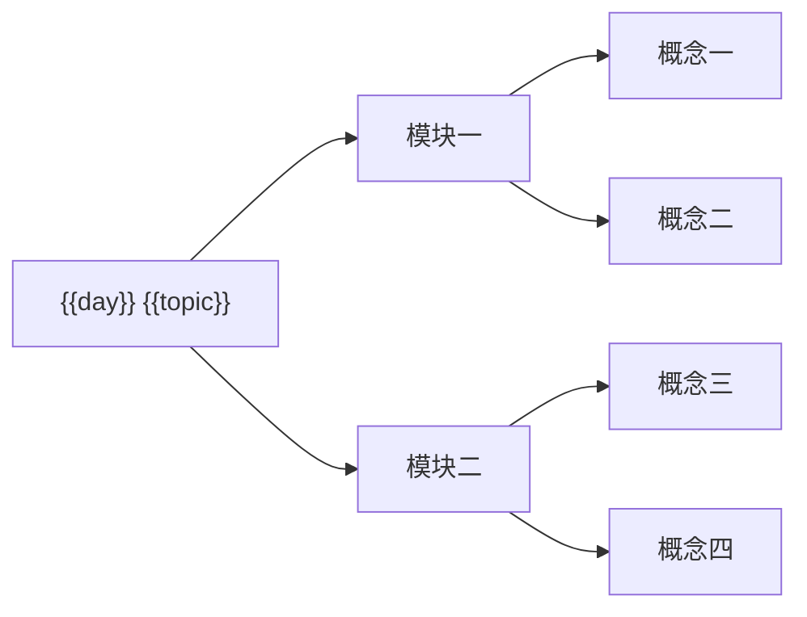

# {{title}}

> 📅 {{study_date}} · {{subject}} · {{source_count}} 个源文件

<!-- DAILY-DIGEST:AI:START -->

## 🧠 今日思维导图

> ← flowchart LR 树形 · 从左到右层级展开 · 紧凑不发散



## 📚 理论：理解技术

### 1. 这项技术是什么

- 定义：
- 解决的问题：
- 使用场景：

### 2. 为什么使用它

- 传统方案的问题：
- 它带来的价值：
- 不适合使用的情况：

### 3. 核心原理

- 关键机制：
- 执行流程：
- 与相关技术的联系：

### 4. 对比与易错点

| 对比项 | 当前技术 | 相似技术 |
|---|---|---|
| 适用场景 |  |  |
| 核心差异 |  |  |

> [!warning] 易错点
> -

> [!info] 原笔记校正
> 仅在源材料存在不准确或过时表述时保留本块；说明“原笔记表述”和“AI 校正”。

## 💻 实操：会使用技术

### 实操一：{{practice_title}}

**场景目标**：

```python
# 保留最小可运行示例，建议不超过 40 行
```

**预期结果**：

**关键步骤**：

1.
2.
3.

**常见错误**：

-

**源文件**：[{{source_name}}]({{source_link}})

## 📎 来源与覆盖

- Manifest：[源文件清单]({{manifest_link}})
- 已读取：
- 脑图审读：总主题 / 总图片；当天纳入路径；相关图片已审读 / 跳过；排除的未来章节。
- 去重文件：
- 未解析或跳过：
- AI 推断与校正：

## 🤖 AI 总结


<!-- DAILY-DIGEST:AI:END -->

<!-- DAILY-DIGEST:USER:START -->

## ✍️ 个人总结

<!-- DAILY-DIGEST:USER:VERSION:2 -->

> 请先折叠上方 AI 总结，脱离笔记填写。Agent 更新本页时不得代填或覆盖本区域。

### 1. 用一句话串起今天的学习主线

>

### 2. 今天最重要的 1～3 个技术分别是什么？

#### 技术一：______

- 是什么：
- 解决什么问题：
- 为什么选择它：
- 怎么使用（输入 → 处理 → 输出）：

#### 技术二：______

- 是什么：
- 解决什么问题：
- 为什么选择它：
- 怎么使用（输入 → 处理 → 输出）：

### 3. 面试官：它和相似技术有什么区别？什么场景下不该使用？

>

### 4. 面试官：实际使用时最容易犯什么错误？如何排查？

>

### 5. 不看代码，写出核心步骤或伪代码

>

### 6. 今天还有什么没有真正理解？下一步如何验证？

>

### 7. 掌握度自评

- [ ] 能看懂
- [ ] 能独立使用
- [ ] 能解释原理
- [ ] 能回答追问

<!-- DAILY-DIGEST:USER:END -->
